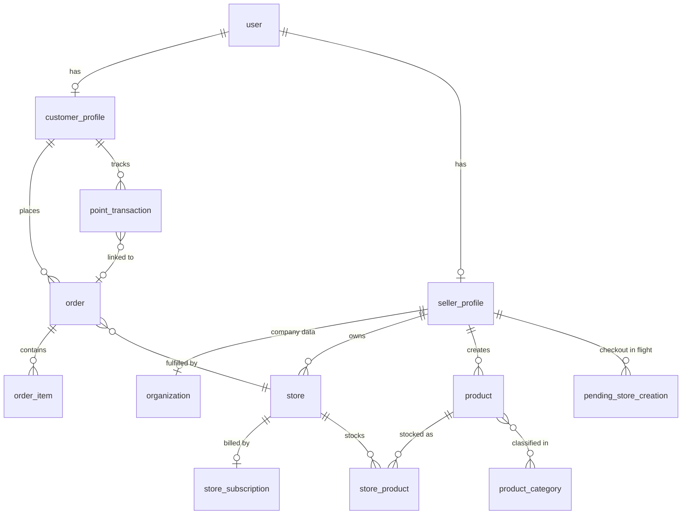

# Architecture

Cross-app overview of the **bibs** monorepo. For setup see the [root README](../README.md);
for project rules and conventions see [AGENTS.md](../AGENTS.md); for the Stripe billing
flow see [stripe-billing.md](stripe-billing.md).

## The monorepo at a glance

Bun workspaces. One backend, three frontends, two shared packages:

| Workspace | What it is | Port |
|---|---|---|
| `apps/api` | Elysia + Bun + Drizzle + PostgreSQL/PostGIS backend | 3000 |
| `apps/customer` | Customer-facing app (TanStack Start + React 19) | 3001 |
| `apps/seller` | Seller back-office (TanStack Start + React 19) | 3002 |
| `apps/admin` | Admin back-office (TanStack Start + React 19) | 3003 |
| `packages/ui` | `@bibs/ui` — shared shadcn/ui component library | — |
| `packages/emails` | `@bibs/emails` — react-email templates (preview on 3004) | — |

The defining property of the stack is **one type flow with no code generation**:

```text
Drizzle table definitions (apps/api/src/db/schemas/)
        ↓ inform
TypeBox schemas (apps/api/src/lib/schemas/) — validation + OpenAPI
        ↓ typed into
Elysia routes → exported `App` type (apps/api/src/types.ts)
        ↓ inferred by
Eden Treaty clients (apps/{customer,seller,admin}/src/lib/api.ts)
```

Change a response type on the server and every frontend call site updates (or breaks
loudly) at the next `bun run typecheck`. This is why the root typecheck is mandatory
after any API change.

## Backend (`apps/api`)

### Request lifecycle and response contract

Every route returns the same envelope. There are two layers of helpers in
`src/lib/responses.ts` (runtime) and `src/lib/schemas/responses.ts` (TypeBox schemas
for OpenAPI):

- `ok(data)` / `okPage(data, pagination)` (`src/lib/responses.ts`) — runtime envelope
  builders
- `okRes(schema)` / `okPageRes(schema)` / `withErrors()` / `withConflictErrors()`
  (`src/lib/schemas/responses.ts`) — TypeBox schema helpers used in route definitions
  so OpenAPI stays accurate
- Success shape: `{ success: true, data }` or `{ success: true, data: [...], pagination: { page, limit, total } }`
  (page `limit` is capped at 100 — request more and you get a `422 VALIDATION_ERROR`)
- Error shape: `{ success: false, error: "ERROR_CODE", message }` — never built by hand

Errors flow through one place, the global error handler (`src/plugins/error-handler.ts`):

- Business errors are thrown as `ServiceError(status, message)`; the error *code* is
  derived from the status, not passed in.
- Routes declare their error surface with `withErrors()` / `withConflictErrors()`
  (`src/lib/schemas/responses.ts`) so OpenAPI stays honest.
- Postgres unique violations (`23505`) are translated to `409` globally — unique-write
  routes don't try/catch for it.

### Auth and roles

[better-auth](https://www.better-auth.com) with the admin plugin, cookie sessions
(HTTP-only) plus bearer-token support. Four roles: **admin**, **seller**, **employee**,
**customer** (`src/lib/permissions.ts`). A user can hold both a customer and a seller
profile.

Routes opt in with `{ auth: true }` and the `auth` macro (`src/plugins/better-auth.ts`).
Better-auth's own endpoints are mounted under `/auth/api/*`; the frontends call them
through `authClient` (`src/lib/auth-client.ts` in each app), not through Eden.

### Modules, by domain

Each module under `src/modules/` is an Elysia plugin (`context.ts` guard + `routes/` +
`services/`). The full, always-current route list lives in the OpenAPI spec at
`http://localhost:3000/openapi` — this table is the domain map, not an inventory:

| Module | Prefix | Owns |
|---|---|---|
| `registration/` | `/register` | customer/seller sign-up, unified sign-in, employee-invite acceptance (password reset is better-auth's native flow) |
| `admin/` | `/admin` | category CRUD + bulk imports, seller verification, profile-change review, holiday definitions, pricing configuration |
| `seller/` | `/seller` | onboarding stepper; stores, images, opening hours, closures; products, brands, stock (incl. CSV import); discounts; orders; employees + invitations; profile/settings change requests; billing + Stripe checkout |
| `customer/` | `/customer` | geo search (PostGIS), profile, addresses, orders, loyalty points |
| `me/` | `/me` | cross-role endpoints for any authenticated user (avatar today) — anything role-independent goes here, never duplicated per role |
| `locations/` | `/locations` | Italian regions / provinces / municipalities (public) |
| `product-categories.ts`, `product-macro-categories.ts`, `store-categories.ts` | — | public taxonomy listings (single-file modules, routes at `/product-categories`, `/product-macro-categories`, `/store-categories`) |
| `webhooks/` | — | Stripe webhook receiver at `/webhooks/stripe` (signature-verified, idempotent — see [stripe-billing.md](stripe-billing.md)) |
| `billing/` | — | internal services only (Stripe customer management shared by seller checkout); no routes |

Background jobs (`src/plugins/cron.ts`):

- **Reservation expiry** — runs every minute
- **Suspend auto-cancel** — runs daily at 03:00 server time (cancels subscriptions that have been suspended past the grace threshold)
- **Pending store creation expiry** — runs hourly (cleans up store checkouts that were never completed)

## Data model, by domain

Table definitions live in `apps/api/src/db/schemas/` (one file per concern; barrel in
`index.ts`). Domains, not an inventory:

- **Identity & profiles** — better-auth tables (`user`, `session`, `account`,
  `verification`); `customer_profiles` (points balance); `seller_profiles` (onboarding
  status ladder, Stripe customer id); `organizations` (company data + VAT);
  `seller_profile_changes` (edits that require admin review).
- **Stores** — `stores` (PostGIS location + GiST index, weekly opening hours, closure
  days); `store_images`; `store_categories`; `holiday_definitions` +
  `store_holiday_optouts` (admin-defined Italian holidays, per-store opt-out);
  `store_subscriptions` (one Stripe subscription per store).
- **Catalog** — `products` (gross prices, VAT rate), `product_images`, `brands`,
  `product_categories` + `product_category_assignments` (m:n), `product_macro_categories`,
  `store_products` (per-store stock), `product_audit_log`, `discounts`.
- **Orders & loyalty** — `orders` (type, status, totals in cents, VAT breakdown),
  `order_items` (price + VAT snapshot at purchase), `point_transactions`
  (earned/redeemed/refunded), `customer_addresses` (PostGIS).
- **Billing (Stripe)** — `pricing_config` (the monthly store fee + live Stripe price id),
  `pending_store_creation` (store form parked until payment), `store_subscriptions`,
  `stripe_events` (webhook idempotency); `payment_methods` exists but is **dormant**
  (reserved for future customer-order payments).
- **Geo** — Italian `regions` / `provinces` / `municipalities`, seeded from committed JSON.



(Domain-grouped and simplified on purpose; the schema files are the source of truth.)

All money is integer cents (`src/lib/money.ts`). VAT is gross-inclusive *scorporo* —
prices include VAT, the breakdown is computed, never added on top (`src/lib/vat.ts`).

## Frontend apps

The three apps share one architecture; if you know one, you know all three:

- **TanStack Start** (SSR) + **TanStack Router** (file-based routes in `src/routes/`,
  generated `routeTree.gen.ts`); auth-guarded routes live under `_authenticated/`.
- **TanStack Query** for data fetching; per-request `QueryClient` during SSR.
- **better-auth client** (`src/lib/auth-client.ts`) for session/sign-in/sign-out.
- **Paraglide JS** for i18n: strings in `messages/{it,en}.json`, generated
  `src/paraglide/` — user-facing copy is never hard-coded.
- **Tailwind CSS v4** + **`@bibs/ui`** components (imported via the `~/` alias).
- **T3Env** (`src/env.ts`) for typed environment variables.

Path aliases (identical in all three apps): `@/*` → `./src/*` (the tsconfig adds
`../api/src/*` as a secondary target for type resolution — write runtime imports
against `./src/*` only), `~/*` → `packages/ui/src/*`.

## Frontend ↔ API integration (Eden Treaty)

Each app builds an isomorphic Eden client in `src/lib/api.ts` with
`createIsomorphicFn` (works in SSR loaders and in the browser) and
`credentials: "include"` so the better-auth cookie rides along. Types come from
`import type { App } from "@bibs/api"` — type-only import, zero backend runtime in the
bundle, **no manual DTOs ever**.

The standard call pattern:

```ts
const { data, error } = await api().seller.stores.get({ query: { page: 1, limit: 20 } })
if (error) throw new Error(error.value.message) // error.value is the typed envelope
```

`error.status` discriminates the typed error union (400 validation, 401, 403, 404, 409
conflict, …) — branch on status, not on the error code string.

Gotchas learned the hard way:

- **Eden hydrates ISO date strings into `Date` objects** — even date-only strings, even
  fields typed `t.String()`. Rendering one raw throws "[object Date]". Coerce with
  `toYMD()` (`src/lib/date.ts` in seller and admin; customer has no date utilities
  yet — add them there when needed). Raw `fetch()` hides the problem;
  always reproduce through the treaty client.
- **Auth goes through `authClient`**, not Eden: better-auth routes are mounted
  dynamically and aren't part of the `App` type.
- The login flow uses better-auth's native `/auth/api/sign-in/email` via
  `authClient.signIn.email(...)` — not the custom `/register/sign-in` wrapper.

## Testing

- **API** (`apps/api/tests/`): `unit/`, `lib/`, `modules/`, `plugins/` run with
  `bun run test:unit`; `integration/` runs real Postgres/PostGIS via **testcontainers**
  (`bun run test:integration`, 180 s timeout). Stripe and email sending are mocked with
  `mock.module(...)`; the database is never mocked. Shared fixtures and the
  testcontainer bootstrap live in `tests/helpers/`.
- **Emails** (`packages/emails`): template snapshot/content tests, run as part of root
  `bun run test`.
- **Frontends**: no automated tests today (the admin `test` script exists but there are
  no test files). UI verification is manual, in the browser — see AGENTS.md.

CI (`.github/workflows/ci.yml`) gates PRs on lint, typecheck, and the API + emails test
suites.

## Email

- **Dev**: [Mailpit](https://mailpit.axllent.org/) runs in `compose.yml`; every email
  the API sends lands in its inbox at <http://localhost:8025>. No real delivery, no
  setup.
- **Templates**: `packages/emails` (react-email 6). Preview server:
  `bun run dev:emails` → <http://localhost:3004>.
- **Sending**: `apps/api/src/lib/email.ts` — POSTs to Mailpit in dev and falls back to
  logging the payload if Mailpit is down, so the API never crashes over email.
