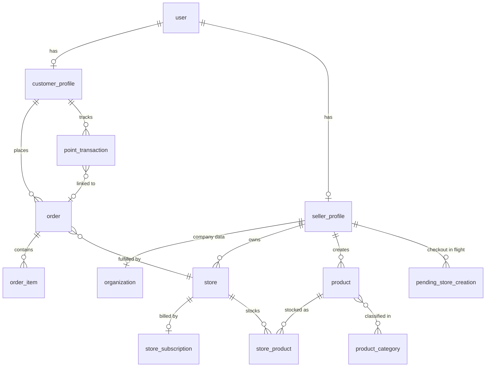

# Documentation Overhaul Implementation Plan

> **For agentic workers:** REQUIRED SUB-SKILL: Use superpowers:subagent-driven-development (recommended) or superpowers:executing-plans to implement this plan task-by-task. Steps use checkbox (`- [ ]`) syntax for tracking.

**Goal:** Bring all project documentation up to date per `docs/superpowers/specs/2026-06-07-docs-overhaul-design.md`: a `docs/` hub (architecture + Stripe billing runbook), slim accurate READMEs, and a sharp AGENTS.md ↔ CLAUDE.md boundary.

**Architecture:** Docs-only change on branch `docs-overhaul`. Two new files in `docs/`, six rewrites, two boundary redistributions, one deletion. Every fact in a draft below was extracted from the codebase on 2026-06-07 — but **the code always wins**: each task starts with fact-check commands; if reality disagrees with a draft, fix the draft, not the code.

**Tech Stack:** Markdown, Mermaid (GitHub renders it), Biome (formatting), Conventional Commits via Lefthook.

**Working rules for every task:**
- All English prose. OpenAPI descriptions and user-facing copy stay Italian (do not touch code).
- No exhaustive enumerations of routes/tables/files — domain level + pointer to code or `/openapi`.
- Never edit `.env`/`.env.local`, `bun.lock`, or anything in the deny-list.
- `DESIGN.md` and `PRODUCT.md` are untouched.

---

## File structure

```
docs/architecture.md                 CREATE   cross-app overview (Task 1)
docs/stripe-billing.md               CREATE   Stripe dev/test runbook (Task 2)
README.md                            REWRITE  entry point + docs map (Task 3)
apps/api/README.md                   REWRITE  API reference (Task 4)
apps/customer/README.md              REWRITE  slim app README (Task 5)
apps/seller/README.md                REWRITE  slim app README (Task 5)
apps/admin/README.md                 REWRITE  slim app README (Task 5)
AGENTS.md                            EDIT     absorbs project rules, fixes facts (Task 6)
CLAUDE.md                            REWRITE  Claude Code tooling only (Task 6)
apps/api/AGENTS.md                   EDIT     modules section + integration link (Task 7)
apps/api/REACT_INTEGRATION.md        DELETE   (Task 7)
```

Verified facts used throughout (re-verify in tasks): seller module prefix `/seller`; checkout routes `POST /seller/stores/checkout`, `GET /seller/checkout-sessions/:sessionId/status`, `GET /seller/stores/checkout/:pendingId`; billing routes `GET /seller/billing/summary|subscriptions|invoices`, `POST /seller/billing/portal`; webhook `POST /webhooks/stripe`; scripts `stripe:bootstrap` + `create-admin` (apps/api), `db:reset`, `dev:emails` (port 3004), `skills:update` (root); `bun run test` = emails + api; admin has `vitest run` script but **zero** test files; modules dir = `admin billing customer locations me product-categories.ts product-macro-categories.ts registration seller store-categories.ts webhooks`; seller route files = `billing brands checkout closures discounts employees images onboarding orders products profile settings stock store-images stores`.

---

### Task 1: Create `docs/architecture.md`

**Files:**
- Create: `docs/architecture.md`

- [ ] **Step 1: Fact-check the draft against the code**

Run each command; where output disagrees with the draft in Step 2, fix the draft.

```bash
ls apps/api/src/modules/                                  # module list
ls apps/api/src/db/schemas/                               # table files
grep -n "prefix" apps/api/src/modules/*/index.ts          # module prefixes
grep -rn "okRes\|okPageRes" apps/api/src/lib/responses.ts | head -5
grep -n "roles\|admin\|seller\|employee\|customer" apps/api/src/lib/permissions.ts | head
grep -rn "pricing" apps/api/src/modules/admin/routes/ | head -3   # does admin manage pricing_config?
ls apps/api/tests/                                        # test layout
grep -n "toYMD" apps/seller/src/lib/date.ts apps/admin/src/lib/date.ts
jq '.scripts.dev' packages/emails/package.json            # port 3004
grep -rn "mock.module" apps/api/tests/integration/*stripe* | head -3
```

Expected: matches the draft. Pay special attention to (a) whether an admin pricing-config route exists — if not, drop "pricing configuration" from the admin module line; (b) the exact public-taxonomy module file names.

- [ ] **Step 2: Write `docs/architecture.md`**

````markdown
# Architecture

Cross-app overview of the **bibs** monorepo. For setup see the [root README](../README.md);
for project rules and conventions see [AGENTS.md](../AGENTS.md); for the Stripe billing
flow see [stripe-billing.md](stripe-billing.md).

## The monorepo at a glance

Bun workspaces. One backend, three frontends, two shared packages:

| Workspace | What it is | Port |
|---|---|---|
| `apps/api` | Elysia + Bun + Drizzle + PostgreSQL/PostGIS backend | 3000 |
| `apps/customer` | Customer-facing app (TanStack Start + React 19) | 3001 |
| `apps/seller` | Seller back-office (TanStack Start + React 19) | 3002 |
| `apps/admin` | Admin back-office (TanStack Start + React 19) | 3003 |
| `packages/ui` | `@bibs/ui` — shared shadcn/ui component library | — |
| `packages/emails` | `@bibs/emails` — react-email templates (preview on 3004) | — |

The defining property of the stack is **one type flow with no code generation**:

```text
Drizzle table definitions (apps/api/src/db/schemas/)
        ↓ inform
TypeBox schemas (apps/api/src/lib/schemas/) — validation + OpenAPI
        ↓ typed into
Elysia routes → exported `App` type (apps/api/src/types.ts)
        ↓ inferred by
Eden Treaty clients (apps/{customer,seller,admin}/src/lib/api.ts)
```

Change a response type on the server and every frontend call site updates (or breaks
loudly) at the next `bun run typecheck`. This is why the root typecheck is mandatory
after any API change.

## Backend (`apps/api`)

### Request lifecycle and response contract

Every route returns the same envelope, built by helpers in `src/lib/responses.ts`:

- `okRes(schema)` / success: `{ success: true, data }`
- `okPageRes(schema)` / paginated: `{ success: true, data: [...], pagination: { page, limit, total } }`
  (page `limit` is capped at 100 — request more and you get a 400)
- errors: `{ success: false, error: "ERROR_CODE", message }` — never built by hand

Errors flow through one place, the global error handler (`src/plugins/error-handler.ts`):

- Business errors are thrown as `ServiceError(status, message)`; the error *code* is
  derived from the status, not passed in.
- Routes declare their error surface with `withErrors()` / `withConflictErrors()`
  (`src/lib/schemas/responses.ts`) so OpenAPI stays honest.
- Postgres unique violations (`23505`) are translated to `409` globally — unique-write
  routes don't try/catch for it.

### Auth and roles

[better-auth](https://www.better-auth.com) with the admin plugin, cookie sessions
(HTTP-only) plus bearer-token support. Four roles: **admin**, **seller**, **employee**,
**customer** (`src/lib/permissions.ts`). A user can hold both a customer and a seller
profile.

Routes opt in with `{ auth: true }` and the `auth` macro (`src/plugins/better-auth.ts`).
Better-auth's own endpoints are mounted under `/auth/api/*`; the frontends call them
through `authClient` (`src/lib/auth-client.ts` in each app), not through Eden.

### Modules, by domain

Each module under `src/modules/` is an Elysia plugin (`context.ts` guard + `routes/` +
`services/`). The full, always-current route list lives in the OpenAPI spec at
`http://localhost:3000/openapi` — this table is the domain map, not an inventory:

| Module | Prefix | Owns |
|---|---|---|
| `registration/` | `/register` | customer/seller sign-up, unified sign-in, password reset, employee-invite acceptance |
| `admin/` | `/admin` | category CRUD + bulk imports, seller verification, profile-change review, holiday definitions |
| `seller/` | `/seller` | onboarding stepper; stores, images, opening hours, closures; products, brands, stock (incl. CSV import); discounts; orders; employees + invitations; profile/settings change requests; billing + Stripe checkout |
| `customer/` | `/customer` | geo search (PostGIS), addresses, orders, loyalty points |
| `me/` | `/me` | cross-role endpoints for any authenticated user (avatar today) — anything role-independent goes here, never duplicated per role |
| `locations/` | `/locations` | Italian regions / provinces / municipalities (public) |
| `product-categories.ts`, `product-macro-categories.ts`, `store-categories.ts` | — | public taxonomy listings (single-file modules) |
| `webhooks/` | `/webhooks` | Stripe webhook receiver (signature-verified, idempotent — see [stripe-billing.md](stripe-billing.md)) |
| `billing/` | — | internal services only (Stripe customer management shared by seller checkout); no routes |

Background jobs: `src/plugins/cron.ts` runs reservation expiry **every minute** and the
suspended-store auto-cancel daily (see the runbook).

## Data model, by domain

Table definitions live in `apps/api/src/db/schemas/` (one file per concern; barrel in
`index.ts`). Domains, not an inventory:

- **Identity & profiles** — better-auth tables (`user`, `session`, `account`,
  `verification`); `customer_profiles` (points balance); `seller_profiles` (onboarding
  status ladder, Stripe customer id); `organizations` (company data + VAT);
  `seller_profile_changes` (edits that require admin review).
- **Stores** — `stores` (PostGIS location + GiST index, weekly opening hours, closure
  days); `store_images`; `store_categories`; `holiday_definitions` +
  `store_holiday_optouts` (admin-defined Italian holidays, per-store opt-out);
  `store_subscriptions` (one Stripe subscription per store).
- **Catalog** — `products` (gross prices, VAT rate), `product_images`, `brands`,
  `product_categories` + `product_classifications` (m:n), `product_macro_categories`,
  `store_products` (per-store stock), `product_audit_log`, `discounts`.
- **Orders & loyalty** — `orders` (type, status, totals in cents, VAT breakdown),
  `order_items` (price + VAT snapshot at purchase), `point_transactions`
  (earned/redeemed/refunded), `customer_addresses` (PostGIS).
- **Billing (Stripe)** — `pricing_config` (the monthly store fee + live Stripe price id),
  `pending_store_creation` (store form parked until payment), `store_subscriptions`,
  `stripe_events` (webhook idempotency); `payment_methods` exists but is **dormant**
  (reserved for future customer-order payments).
- **Geo** — Italian `regions` / `provinces` / `municipalities`, seeded from committed JSON.



(Domain-grouped and simplified on purpose; the schema files are the source of truth.)

All money is integer cents (`src/lib/money.ts`). VAT is gross-inclusive *scorporo* —
prices include VAT, the breakdown is computed, never added on top (`src/lib/vat.ts`).

## Frontend apps

The three apps share one architecture; if you know one, you know all three:

- **TanStack Start** (SSR) + **TanStack Router** (file-based routes in `src/routes/`,
  generated `routeTree.gen.ts`); auth-guarded routes live under `_authenticated/`.
- **TanStack Query** for data fetching; per-request `QueryClient` during SSR.
- **better-auth client** (`src/lib/auth-client.ts`) for session/sign-in/sign-out.
- **Paraglide JS** for i18n: strings in `messages/{it,en}.json`, generated
  `src/paraglide/` — user-facing copy is never hard-coded.
- **Tailwind CSS v4** + **`@bibs/ui`** components (imported via the `~/` alias).
- **T3Env** (`src/env.ts`) for typed environment variables.

Path aliases (identical in all three apps): `@/*` → `./src/*`, `~/*` →
`packages/ui/src/*`.

## Frontend ↔ API integration (Eden Treaty)

Each app builds an isomorphic Eden client in `src/lib/api.ts` with
`createIsomorphicFn` (works in SSR loaders and in the browser) and
`credentials: "include"` so the better-auth cookie rides along. Types come from
`import type { App } from "@bibs/api"` — type-only import, zero backend runtime in the
bundle, **no manual DTOs ever**.

The standard call pattern:

```ts
const { data, error } = await api().seller.stores.get({ query: { page: 1, limit: 20 } })
if (error) throw new Error(error.value.message) // error.value is the typed envelope
```

`error.status` discriminates the typed error union (400 validation, 401, 403, 404, 409
conflict, …) — branch on status, not on the error code string.

Gotchas learned the hard way:

- **Eden hydrates ISO date strings into `Date` objects** — even date-only strings, even
  fields typed `t.String()`. Rendering one raw throws "[object Date]". Coerce with
  `toYMD()` (`src/lib/date.ts` in seller/admin). Raw `fetch()` hides the problem;
  always reproduce through the treaty client.
- **Auth goes through `authClient`**, not Eden: better-auth routes are mounted
  dynamically and aren't part of the `App` type.
- The login flow uses better-auth's native `/auth/api/sign-in/email` via
  `authClient.signIn.email(...)` — not the custom `/register/sign-in` wrapper.

## Testing

- **API** (`apps/api/tests/`): `unit/`, `lib/`, `modules/`, `plugins/` run with
  `bun run test:unit`; `integration/` runs real Postgres/PostGIS via **testcontainers**
  (`bun run test:integration`, 180 s timeout). Stripe and email sending are mocked with
  `mock.module(...)`; the database is never mocked.
- **Emails** (`packages/emails`): template snapshot/content tests, run as part of root
  `bun run test`.
- **Frontends**: no automated tests today (the admin `test` script exists but there are
  no test files). UI verification is manual, in the browser — see AGENTS.md.

CI (`.github/workflows/ci.yml`) gates PRs on lint, typecheck, and the API + emails test
suites.

## Email

- **Dev**: [Mailpit](https://mailpit.axllent.org/) runs in `compose.yml`; every email
  the API sends lands in its inbox at <http://localhost:8025>. No real delivery, no
  setup.
- **Templates**: `packages/emails` (react-email 6). Preview server:
  `bun run dev:emails` → <http://localhost:3004>.
- **Sending**: `apps/api/src/lib/email.ts` — POSTs to Mailpit in dev and falls back to
  logging the payload if Mailpit is down, so the API never crashes over email.
````

- [ ] **Step 3: Verify rendered output and links**

```bash
grep -c 'mermaid' docs/architecture.md             # expected: ≥1 (the ER block)
ls README.md AGENTS.md docs/stripe-billing.md 2>&1 # referenced targets
```

Expected: `docs/stripe-billing.md` does **not** exist yet (Task 2) — that's fine, note it and re-check at Task 8. `README.md` and `AGENTS.md` exist.

- [ ] **Step 4: Commit**

```bash
git add docs/architecture.md
git commit -m "docs: add cross-app architecture overview"
```

---

### Task 2: Create `docs/stripe-billing.md`

**Files:**
- Create: `docs/stripe-billing.md`

- [ ] **Step 1: Fact-check the draft against the code**

```bash
grep -oE '"(/[^"]*)"' apps/api/src/modules/seller/routes/checkout.ts | sort -u
# expected: "/checkout-sessions/:sessionId/status" "/stores/checkout" "/stores/checkout/:pendingId"
grep -oE '"(/[^"]*)"' apps/api/src/modules/seller/routes/billing.ts | sort -u
# expected: "/billing" "/invoices" "/portal" "/subscriptions" "/summary"
grep -n "constructEventAsync\|stripe-signature" apps/api/src/modules/webhooks/routes/stripe.ts
grep -rn "case \"" apps/api/src/modules/webhooks/services/dispatcher.ts   # handled event types
sed -n '1,12p' apps/api/src/scripts/stripe-bootstrap.ts                   # bootstrap behavior
grep -rn "past_due\|canceling\|suspended" apps/api/src/db/seed/fixtures/billing-subscriptions.ts | head
grep -n "suspendedAutoCancelDays\|pendingCreationExpiryHours" apps/api/src/db/schemas/pricing-config.ts
grep -rn "auto-cancel" apps/api/src/plugins/cron.ts apps/api/src/lib/jobs/ 2>/dev/null | head -3
grep -n "processing\|session_id" apps/seller/src/routes/_authenticated/store -r | head -5
ls apps/api/tests/integration/ | grep -i stripe
```

Confirm in particular: the exact handled webhook event types, the seed billing-state mix (counts), the auto-cancel job name/cadence, and the seller processing route path. Fix the draft where it disagrees.

- [ ] **Step 2: Write `docs/stripe-billing.md`**

````markdown
# Stripe billing — developer runbook

How money works in bibs today, and how to exercise the whole flow on your machine.
Architecture context: [architecture.md](architecture.md). Design rationale:
[the billing spec](superpowers/specs/2026-05-26-seller-store-subscription-billing-design.md).

> **Scope.** Stripe is used for one thing: the **per-store monthly subscription paid by
> sellers**. Customers never touch Stripe — customer order payment does not exist yet
> (see [What does NOT exist](#what-does-not-exist-yet)).

## The model in 2 minutes

Every active store costs its seller a flat monthly fee (default €29, defined in the
`pricing_config` table together with the live Stripe price id). Creating a store **is**
a Stripe Checkout:

```text
seller fills the store form (/store/new in the seller app)
   │  POST /seller/stores/checkout
   ▼
API parks the form in pending_store_creation (status=open)
and creates a Stripe Checkout Session (mode: subscription)
   │  302 → Stripe-hosted payment page
   ▼
seller pays (test card) → Stripe redirects back to
/store/new/processing?session_id=… which polls
GET /seller/checkout-sessions/:sessionId/status every second
   │
   │  meanwhile, asynchronously:
   ▼
Stripe → POST /webhooks/stripe  (checkout.session.completed)
   ▼
webhook handler, in one transaction: INSERT store,
INSERT store_subscription (active), pending → consumed
   ▼
polling sees status=ready + storeId → redirect to the new store
```

The store **only exists after the webhook lands**. No webhook forwarding → payment
succeeds but the processing page spins forever. That is the #1 local-dev gotcha; setup
below fixes it.

### Subscription states

`store_subscriptions.status` is moved exclusively by webhooks plus one cron:

| Status | Meaning | Moved by |
|---|---|---|
| `active` | paid and current | `checkout.session.completed`, `invoice.payment_succeeded` |
| `past_due` | a renewal failed; Stripe is retrying (dunning) | `invoice.payment_failed` |
| `canceling` | seller asked to cancel at period end (reversible) | `customer.subscription.updated` |
| `suspended` | dunning exhausted; store hidden from customers | `customer.subscription.updated` (status `unpaid`) |
| `canceled` | terminal; store soft-deleted/archived | `customer.subscription.deleted` |

A daily job auto-cancels subscriptions that have been `suspended` longer than
`pricing_config.suspendedAutoCancelDays` (default 60).

The webhook endpoint (`POST /webhooks/stripe`) verifies the `stripe-signature` header
with `constructEventAsync` (the async variant is required on Bun) and is idempotent via
the `stripe_events` table (`INSERT … ON CONFLICT DO NOTHING`; `processedAt` stays NULL
on handler failure so Stripe's retry reprocesses it).

## One-time setup

1. **Stripe account** in test mode (free): <https://dashboard.stripe.com>. Grab the
   secret key (`sk_test_…`) from Developers → API keys.
2. **API env** — in `apps/api/.env`:

   ```env
   STRIPE_SECRET_KEY=sk_test_…
   ```

3. **Create the dev Product+Price** (idempotent — it searches before creating):

   ```bash
   bun run --cwd apps/api stripe:bootstrap
   ```

   Copy the printed id into `apps/api/.env`:

   ```env
   STRIPE_DEV_PRICE_ID=price_…
   ```

   The seed wires this price into `pricing_config`; without it, checkout creation
   fails with a clear error.

4. **Webhook forwarding** — install the [Stripe CLI](https://stripe.com/docs/stripe-cli)
   (`brew install stripe/stripe-cli/stripe`), then in a dedicated terminal:

   ```bash
   stripe login          # once
   stripe listen --forward-to localhost:3000/webhooks/stripe
   ```

   It prints `whsec_…` — put it in `apps/api/.env` and restart the API:

   ```env
   STRIPE_WEBHOOK_SECRET=whsec_…
   ```

   Keep `stripe listen` running whenever you test checkout. Its log is also your best
   debugging tool: every event and the API's HTTP response code show up there.

## Happy path walkthrough

Prereqs: infra up, DB seeded (`bun run db:reset` for a clean slate), `bun run dev`,
`stripe listen` running.

1. Log in to the seller app (<http://localhost:3002>) as **`seller@dev.bibs` /
   `password123`** — the dev seller is fully onboarded with active stores, so you skip
   the onboarding stepper. (To test the *first-store* variant, register a fresh seller
   and walk the stepper instead.)
2. Go to **`/store/new`**, fill the form, submit. The app calls
   `POST /seller/stores/checkout` and redirects you to the Stripe-hosted page.
3. Pay with the standard test card: **`4242 4242 4242 4242`**, any future expiry, any
   CVC, any name/postal code.
4. You land on `/store/new/processing?session_id=cs_test_…`. Within a second or two the
   `checkout.session.completed` event arrives and the page redirects to the new store.

What to verify when something looks off:

| Checkpoint | How |
|---|---|
| Session created | API response/log; a `pending_store_creation` row with `status='open'` |
| Webhook delivered | `stripe listen` log: `checkout.session.completed → 200` |
| Event recorded | `stripe_events` row with `processedAt` set (`bun run db:studio`) |
| Store + subscription | `stores` row exists; `store_subscriptions.status='active'` |
| Pending consumed | `pending_store_creation.status='consumed'` |

## Beyond the happy path

### Cancel mid-checkout (resume)

Click the back arrow on the Stripe page. You return to `/store/new?cancel=<pendingId>`;
the app fetches `GET /seller/stores/checkout/:pendingId` and repopulates the form.
Submitting again **reuses** the open session if still valid (one open pending per
seller is enforced by a partial unique index).

### Declined cards and 3DS

| Card | Behavior |
|---|---|
| `4000 0000 0000 0002` | declined (generic) |
| `4000 0025 0000 3155` | requires 3DS authentication |
| `4000 0000 0000 9995` | declined (insufficient funds) |

Full list: <https://stripe.com/docs/testing>.

### Failed renewal → dunning → suspension

Real renewals are monthly, so you simulate. Two honest options:

- **`stripe trigger invoice.payment_failed`** exercises your webhook plumbing
  end-to-end, **but** the synthetic event references a fixture subscription, not one of
  yours — the handler will no-op on the unknown subscription id. Good for testing
  signature/idempotency wiring, useless for state transitions.
- **Seeded states** (next section) are the practical way to get every billing state in
  the UI without Stripe at all.

To watch a real transition, use the [Customer Portal](#customer-portal): cancel or
update the payment method there and watch `customer.subscription.updated` arrive.

### Customer Portal

The seller billing page (`/billing` in the seller app) shows the monthly total, the
per-store subscription list (with `past_due` / `canceling` / `suspended` banners), lazy-
loaded invoices, and a **"Manage payments"** button → `POST /seller/billing/portal` →
Stripe-hosted portal (update card, view invoice PDFs, cancel).

### Voluntary cancellation

Cancel from the store settings (sets `cancel_at_period_end` on the subscription →
status `canceling`, reversible until period end). At period end Stripe fires
`customer.subscription.deleted` → status `canceled`, store soft-deleted (archived,
read-only).

## Seed-provided states (no Stripe needed)

`bun run db:seed` creates subscriptions in a realistic mix — work on billing UI without
configuring Stripe at all:

| Seeded state | Count | Use it to see |
|---|---|---|
| `active` | most stores | the normal case |
| `past_due` | 3 | renewal-failed banner + dunning copy |
| `canceling` | 2 | "deactivates on <date>" + undo |
| `suspended` | 1 | blocking banner, store hidden from customers |
| `canceled` | 1 | archived store (soft-deleted) |

(Seeded rows carry fake `sub_seed_…` Stripe ids; portal/invoice calls against them will
404 on Stripe — expected.)

## Automated tests

Integration tests cover checkout-session creation and every webhook handler with the
**Stripe SDK fully mocked** (`mock.module("@/lib/stripe", …)`) and a **real Postgres**
via testcontainers:

```bash
cd apps/api
bun test tests/integration/seller-stores-checkout.test.ts
bun test tests/integration/stripe-webhook-checkout-completed.test.ts
bun test tests/integration/stripe-webhook-subscription-lifecycle.test.ts
```

The mock does not exercise real signature verification — that's what `stripe listen`
in dev is for.

## What does NOT exist (yet)

Be explicit about this in reviews and planning:

- **Customer order payment.** `pay_pickup` / `pay_deliver` exist in the order state
  machine, and a `payment_methods` table exists, but **no Stripe flow runs for customer
  orders** — no PaymentIntent, no Connect. Documenting or testing "customer checkout
  via Stripe" is not possible today.
- **SDI e-invoicing** (fattura elettronica) — MVP relies on Stripe-hosted receipts.
- **Refunds / disputes** — webhook events are ignored; manual via Stripe dashboard.
- **Multi-currency** — schema carries `currency` but everything is EUR.
- **Plan tiers / upgrades** — one flat fee; no plan changes.
- **Reactivation** — a `canceled` store stays archived; create a new store instead.

Rationale and full design: [billing spec](superpowers/specs/2026-05-26-seller-store-subscription-billing-design.md).

## Troubleshooting

| Symptom | Cause → fix |
|---|---|
| Processing page spins forever | Webhook never arrived. Is `stripe listen` running? Is `STRIPE_WEBHOOK_SECRET` the one it printed (it changes per `stripe login`)? Restart the API after editing `.env`. |
| `400` signature verification failed | Body was re-serialized or the secret is stale. The route reads the **raw** body and uses `constructEventAsync` (Bun's SubtleCrypto has no sync mode) — don't add body-parsing middleware in front of `/webhooks/stripe`. |
| Checkout creation fails about price | `STRIPE_DEV_PRICE_ID` missing/wrong, or seed ran without it → `pricing_config` has no usable price. Run `stripe:bootstrap`, set the env var, `bun run db:reset`. |
| Webhook 200 but nothing changed | Replay of an already-processed event (`stripe_events` dedup) or an event for an unknown subscription (e.g. `stripe trigger` fixtures, seeded `sub_seed_…` ids). Both are by design. |
| Pending expired | `pending_store_creation` expires after `pricing_config.pendingCreationExpiryHours` (default 24). Submit the form again — a fresh pending+session is created. |
````

- [ ] **Step 3: Verify every command quoted in the doc**

```bash
bun run --cwd apps/api stripe:bootstrap --help 2>&1 | head -3   # script exists (will error on missing key — fine)
ls apps/api/tests/integration/seller-stores-checkout.test.ts \
   apps/api/tests/integration/stripe-webhook-checkout-completed.test.ts \
   apps/api/tests/integration/stripe-webhook-subscription-lifecycle.test.ts
grep -n "store/new/processing" apps/seller/src/routes -r | head -2
ls docs/superpowers/specs/2026-05-26-seller-store-subscription-billing-design.md
```

Expected: all paths exist. If a test file name differs, fix the doc.

- [ ] **Step 4: Commit**

```bash
git add docs/stripe-billing.md
git commit -m "docs: add Stripe billing developer runbook"
```

---

### Task 3: Rewrite root `README.md`

**Files:**
- Modify: `README.md` (full rewrite)

- [ ] **Step 1: Fact-check**

```bash
jq -r '.scripts | keys[]' package.json        # confirm script names in the table below
grep -n "container_name\|ports" compose.yml   # 3 services + ports
```

- [ ] **Step 2: Write the new `README.md`**

````markdown
# bibs

[](https://github.com/gellaz/bibs/actions/workflows/ci.yml)

Monorepo for **bibs** — a local-commerce marketplace for Italian neighborhoods.
Customers find and buy from nearby shops; sellers run their digital storefront; the
platform charges sellers a per-store subscription. The why and the brand live in
[PRODUCT.md](PRODUCT.md) and [DESIGN.md](DESIGN.md).

## Structure

```text
apps/
  api/         → Backend API (Elysia + Bun + Drizzle + PostGIS)        :3000
  customer/    → Customer-facing web app (TanStack Start + React 19)   :3001
  seller/      → Seller back-office (TanStack Start + React 19)        :3002
  admin/       → Admin back-office (TanStack Start + React 19)         :3003
packages/
  ui/          → Shared UI components (shadcn/ui + Tailwind CSS v4)
  emails/      → Transactional email templates (react-email)           :3004 (preview)
```

Dev infrastructure (Docker): **PostGIS** :5432 · **MinIO** :9000/:9001 · **Mailpit**
(email catcher) UI :8025.

## Prerequisites

- [Bun](https://bun.sh/) ≥ 1.3
- [Docker](https://www.docker.com/) (PostGIS, MinIO, Mailpit)

## Getting started

```bash
bun install          # dependencies + git hooks (Lefthook)
bun run infra:up     # PostGIS + MinIO + Mailpit
bun run db:migrate   # apply migrations
bun run db:seed      # test data (incl. dev accounts — see apps/api/README.md)
bun run dev          # API + all three apps
```

To exercise Stripe checkout locally you need a few extra one-time steps — follow
[docs/stripe-billing.md](docs/stripe-billing.md).

## Documentation map

| You want to… | Read |
|---|---|
| Understand the system end to end | [docs/architecture.md](docs/architecture.md) |
| Test the Stripe checkout / billing flow | [docs/stripe-billing.md](docs/stripe-billing.md) |
| Work on the API | [apps/api/README.md](apps/api/README.md) |
| Work on an app | [customer](apps/customer/README.md) · [seller](apps/seller/README.md) · [admin](apps/admin/README.md) · [ui](packages/ui/README.md) |
| Know the project rules & conventions (humans and agents) | [AGENTS.md](AGENTS.md) |
| Understand product & brand decisions | [PRODUCT.md](PRODUCT.md) · [DESIGN.md](DESIGN.md) |
| Claude Code-specific tooling | [CLAUDE.md](CLAUDE.md) |

## Scripts

| Script | Description |
|---|---|
| `bun run dev` | Start **all** apps concurrently |
| `bun run dev:api` / `dev:customer` / `dev:seller` / `dev:admin` | Start one app (ports 3000/3001/3002/3003) |
| `bun run dev:emails` | react-email preview server (port 3004) |
| `bun run typecheck` | TypeScript check across all workspaces |
| `bun run test` | Email-template tests + API tests (unit + integration) |
| `bun run lint` / `lint:fix` / `format` | Biome |
| `bun run infra:up` / `infra:down` | Start / stop Docker services |
| `bun run infra:reset` | Stop and **wipe volumes** |
| `bun run db:generate` / `db:migrate` | Generate / apply Drizzle migrations |
| `bun run db:push` | Push schema without migrations (local experiments only) |
| `bun run db:studio` | Drizzle Studio |
| `bun run db:seed` | Seed test data into a fresh DB |
| `bun run db:reset` | Wipe volumes → migrate → seed (one shot) |
| `bun run --cwd apps/api stripe:bootstrap` | Create the dev Stripe Product+Price (see runbook) |
| `bun run --cwd apps/api create-admin` | Create an admin user |
| `bun run skills:update` | Refresh checked-in agent skills |
````

- [ ] **Step 3: Verify links**

```bash
for f in PRODUCT.md DESIGN.md AGENTS.md CLAUDE.md docs/architecture.md docs/stripe-billing.md \
         apps/api/README.md apps/customer/README.md apps/seller/README.md apps/admin/README.md \
         packages/ui/README.md; do [ -f "$f" ] && echo "OK $f" || echo "MISSING $f"; done
```

Expected: all OK.

- [ ] **Step 4: Commit**

```bash
git add README.md
git commit -m "docs: rewrite root README as entry point with documentation map"
```

---

### Task 4: Rewrite `apps/api/README.md`

**Files:**
- Modify: `apps/api/README.md` (full rewrite)

- [ ] **Step 1: Fact-check**

```bash
cat apps/api/.env.example                                     # env vars section must match exactly
jq -r '.scripts | keys[]' apps/api/package.json
grep -n "pending_email\|pending_personal\|pending_document\|pending_company\|pending_review" \
  apps/api/src/db/schemas/seller.ts                            # onboarding ladder
grep -rn "seller@dev.bibs" apps/api/src/db/seed/ | head -3
grep -rn "test.com\|password123" apps/api/src/db/seed/fixtures/*.ts | head -10   # bulk fixture pattern
grep -n "EVERY_MINUTE\|expireReservations" apps/api/src/plugins/cron.ts
grep -n "SHIPPING\|5" apps/api/src/lib/config.ts | head -5     # shipping cost constant still €5?
curl -s http://localhost:3000/health 2>/dev/null || echo "API not running — start it for quickstart verification"
```

Confirm: the onboarding status ladder values, the dev-seller fixture, the bulk fixture email pattern + counts (read `apps/api/src/db/seed/fixtures/{admins,customers,sellers}.ts` headers), the shipping cost. **The quickstart curl commands in the draft must be executed against a running seeded API** and the responses sanity-checked.

- [ ] **Step 2: Write the new `apps/api/README.md`**

Keep these sections, rewritten (full draft below is normative except where Step 1 facts disagree):

````markdown
# @bibs/api

Backend API for **bibs**. Sellers manage stores, products and orders and pay a monthly
per-store subscription (Stripe); customers search by location, order (in-store pickup
or delivery) and earn loyalty points; admins curate taxonomies and verify sellers.

System overview and patterns: [docs/architecture.md](../../docs/architecture.md).
Stripe local-dev runbook: [docs/stripe-billing.md](../../docs/stripe-billing.md).

## Tech stack

- **Runtime** [Bun](https://bun.sh) · **Framework** [Elysia](https://elysiajs.com)
- **DB** PostgreSQL 18 + PostGIS 3.6 (Docker) · **ORM** [Drizzle](https://orm.drizzle.team)
- **Auth** [better-auth](https://www.better-auth.com) (email/password, RBAC admin plugin)
- **Storage** MinIO via Bun's native S3 client · **Payments** Stripe (subscriptions)
- **Email** Mailpit in dev via `src/lib/email.ts`, templates in `packages/emails`
- **Docs** OpenAPI auto-generated — Scalar UI at `/openapi`, JSON at `/openapi/json`

## Getting started

From the **monorepo root**:

```bash
bun install
bun run infra:up        # PostGIS + MinIO + Mailpit
cp apps/api/.env.example apps/api/.env   # then edit values
bun run db:migrate
bun run db:seed
bun run dev:api         # http://localhost:3000
```

### Environment variables

`src/lib/env.ts` validates everything at boot and exits with a clear message if a
required variable is missing. See [.env.example](./.env.example) for the full annotated
list. Highlights:

| Variable | Required | Notes |
|---|---|---|
| `DATABASE_URL` | yes | pool tuning via optional `DATABASE_POOL_MAX`, `DATABASE_IDLE_TIMEOUT_MS`, `DATABASE_CONNECTION_TIMEOUT_MS` |
| `BETTER_AUTH_SECRET`, `BETTER_AUTH_URL` | yes | |
| `S3_ENDPOINT`, `S3_ACCESS_KEY`, `S3_SECRET_KEY`, `S3_BUCKET` | yes | MinIO in dev; bucket auto-created at startup |
| `STRIPE_SECRET_KEY` | yes | test-mode key is fine; see the [runbook](../../docs/stripe-billing.md) |
| `STRIPE_WEBHOOK_SECRET` | no | required only to receive webhooks (i.e. to complete a checkout) |
| `STRIPE_DEV_PRICE_ID` | no | created by `bun run stripe:bootstrap` |
| `MAILPIT_URL` | no | defaults to `http://localhost:8025` |
| `ALLOWED_ORIGINS`, `TRUST_PROXY` | no | production CORS / proxy hardening |

## Scripts

| Command | Description |
|---|---|
| `bun run dev` | Dev server with watch mode (port 3000) |
| `bun run test` | Unit + integration (integration uses testcontainers; Docker required) |
| `bun run test:unit` / `test:integration` | Split runs |
| `bun run typecheck` | `tsc --noEmit` |
| `bun run db:generate` / `db:migrate` / `db:push` / `db:studio` / `db:seed` | Drizzle |
| `bun run db:clean` | Delete all migration files |
| `bun run stripe:bootstrap` | Create the dev Stripe Product+Price (idempotent) |
| `bun run create-admin` | Interactive admin-user creation |

## Modules

One Elysia plugin per domain under `src/modules/` (`context.ts` guard + `routes/` +
`services/`). The domain map and shared patterns (response envelope, error contract,
auth macro) are documented in [docs/architecture.md](../../docs/architecture.md); the
authoritative route list is the OpenAPI spec at `http://localhost:3000/openapi`.

In one line each: `registration` (sign-up/sign-in/password-reset/invites), `admin`
(taxonomies, seller verification, change review, holidays), `seller` (onboarding,
stores, catalog, stock, discounts, orders, team, settings, billing/checkout),
`customer` (geo search, addresses, orders, points), `me` (cross-role endpoints),
`locations` (Italian geo data), public taxonomy listings, `webhooks` (Stripe).

## Orders, points, reservations

Four order types: **direct** (in-store, completes immediately), **reserve_pickup**
(stock held 48 h), **pay_pickup** and **pay_deliver** (fixed €5.00 shipping). Status
transitions are enforced by `src/lib/order-state-machine.ts`; not every transition is
valid for every type.

Order creation (single transaction): stock check → totals in integer cents → optional
points discount (100 points = €1, capped at total) → insert order + items (with VAT
snapshot) → atomic stock decrement (`SET stock = stock - N WHERE stock >= N`, 409 on
race) → points deduction. Cancellation refunds stock and points; completion awards
points on the final total.

`reserve_pickup` orders expire after 48 h: a cron (`src/plugins/cron.ts`) runs
`expireReservations()` **every minute** — single source of truth, resilient to restarts;
worst-case latency between configured expiry and the status flip is ~60 s.

VAT is gross-inclusive (*scorporo*): products carry a `vatRate`, order items snapshot
it, orders store the VAT breakdown. Pure logic in `src/lib/vat.ts`.

## Authentication

Four roles via better-auth's admin plugin: **admin**, **seller**, **employee**,
**customer**. Sessions are HTTP-only cookies (bearer token also supported). Custom
unified endpoints under `/register/*` (sign-up creates the right profile; sign-in
returns user + both profiles); better-auth's own endpoints live under `/auth/api/*`.
Routes opt in with `{ auth: true }`.

Seller onboarding is a status ladder on `seller_profiles`:
`pending_email → pending_personal → pending_document → pending_company →
pending_review → active | rejected`. Admins review at `pending_review`. Store creation
(and its Stripe checkout) is a post-activation step — see the
[runbook](../../docs/stripe-billing.md).

## Seed data

`bun run db:seed` (or `bun run db:reset` for wipe + migrate + seed) creates:

| Account | Password | Use it for |
|---|---|---|
| **`seller@dev.bibs`** | `password123` | the primary dev account: fully onboarded, 2 stores with active subscriptions — skips onboarding entirely |
| `admin1–3@test.com` | `password123` | admin back-office |
| `customer1–300@test.com` | `password123` | bulk customers |
| `seller1–N@test.com` | `password123` | bulk sellers spread across every onboarding status (see `src/db/seed/fixtures/sellers.ts` for the exact distribution) |

Store subscriptions are seeded in a realistic state mix (active / past_due / canceling
/ suspended / canceled) so billing UI can be exercised without Stripe — details in the
[runbook](../../docs/stripe-billing.md#seed-provided-states-no-stripe-needed).

## API quickstart

```bash
curl http://localhost:3000/health

# Sign in (returns a bearer token; cookies also set)
curl -X POST http://localhost:3000/register/sign-in \
  -H "Content-Type: application/json" \
  -d '{"email": "customer1@test.com", "password": "password123"}'

# Public product search, geo-filtered (10 km around Milan)
curl "http://localhost:3000/customer/search?q=pizza&lat=45.4642&lng=9.19&radius=10"

# Authenticated request
curl http://localhost:3000/user -H "Authorization: Bearer <token>"
```

Interactive docs: `http://localhost:3000/openapi`.

## Response envelope

```jsonc
{ "success": true, "data": { … } }                                    // success
{ "success": true, "data": [ … ], "pagination": { "page": 1, "limit": 20, "total": 100 } }
{ "success": false, "error": "ERROR_CODE", "message": "…" }           // error
```

Pagination `limit` is capped at **100** (larger values → 400). Error semantics and the
global handler are described in [docs/architecture.md](../../docs/architecture.md).

## Logging, health, shutdown

Structured logging via logixlysia + Pino (request logs, JSON, daily rotation in
`logs/`, sensitive-field redaction). `GET /health` checks DB connectivity (200/503).
On SIGTERM/SIGINT the server drains, closes the pool, exits.

## CORS

Development: any `localhost` port is accepted automatically. Production: set
`ALLOWED_ORIGINS` (comma-separated) **and** `NODE_ENV=production`. Credentials are
enabled for cookie auth.

## Troubleshooting

| Problem | Fix |
|---|---|
| Port 5432 already in use | Another Postgres owns it (`lsof -i :5432`). Note: after a failed bind, Docker Desktop's port forwarding can stay stuck — recreate the container or restart Docker Desktop. |
| DB connection refused | `bun run infra:up`; check `DATABASE_URL` matches `compose.yml`. |
| Schema out of sync | `bun run db:reset` (wipes data). |
| `Missing or invalid env vars` at boot | Copy `.env.example` → `.env`; the error lists what's missing. |
| `type "geometry" does not exist` | You're not on the project's PostGIS image (`docker/postgis/`). |
| S3/MinIO errors | Bucket is auto-created at startup; verify the `S3_*` vars match `compose.yml`. |
| Stripe checkout never completes | See the [runbook troubleshooting](../../docs/stripe-billing.md#troubleshooting). |
| Typecheck fails after pulling | `bun install` first. |
````

- [ ] **Step 3: Execute the quickstart commands against a running seeded API**

```bash
bun run infra:up && bun run dev:api &   # if not already running
sleep 5
curl -s http://localhost:3000/health
curl -s -X POST http://localhost:3000/register/sign-in -H "Content-Type: application/json" \
  -d '{"email": "customer1@test.com", "password": "password123"}' | head -c 200
curl -s "http://localhost:3000/customer/search?q=pizza&lat=45.4642&lng=9.19&radius=10" | head -c 200
```

Expected: `{"status":"ok"}`-shaped health, a success envelope from sign-in, a paginated envelope from search. If sign-in fails, re-check the seeded fixture emails and fix the table.

- [ ] **Step 4: Commit**

```bash
git add apps/api/README.md
git commit -m "docs(api): rewrite README — real modules, seed, env, Stripe pointers"
```

---

### Task 5: Rewrite the three app READMEs

**Files:**
- Modify: `apps/customer/README.md`, `apps/seller/README.md`, `apps/admin/README.md` (full rewrites)

- [ ] **Step 1: Fact-check**

```bash
ls apps/customer/src/routes apps/customer/src/routes/_authenticated 2>/dev/null
ls apps/seller/src/routes/_authenticated
ls apps/admin/src/routes/_authenticated
cat apps/customer/.env.example apps/seller/.env.example apps/admin/.env.example
jq -r '.scripts | keys[]' apps/customer/package.json apps/seller/package.json apps/admin/package.json
find apps/admin -name "*.test.*" -not -path "*/node_modules/*" | head -3   # expect: nothing
```

Use the route listings only to validate the **prose domain lists** below — do not add file trees.

- [ ] **Step 2: Write the three files**

Shared template — identical "Stack", "Scripts", "Aliases", "i18n", "API" sections; only the header, domains, port, and env vars differ. `apps/customer/README.md`:

````markdown
# @bibs/customer

Customer-facing web app for **bibs** — browse local stores, search products, order,
earn loyalty points.

**Implemented today:** registration and the full password lifecycle (verify-email,
forgot/reset password) and the user profile. The storefront (search, store pages,
cart/checkout) is **not built yet** — the API for it exists (see
[apps/api](../api/README.md)), the UI doesn't.

## Stack

TanStack Start (SSR) + React 19 + TanStack Query + Eden Treaty + better-auth +
Paraglide (it/en) + Tailwind v4 + [@bibs/ui](../../packages/ui/). The shared frontend
architecture — routing conventions, data fetching, auth, aliases, gotchas — is
documented once in [docs/architecture.md](../../docs/architecture.md).

## Getting started

```bash
# from the monorepo root
bun install && bun run infra:up && bun run db:migrate && bun run db:seed
bun run dev:customer    # http://localhost:3001
```

## Scripts

`dev` (port 3001) · `build` · `preview` · `typecheck` · `lint` · `format` · `check`

## Environment

Copy `.env.example` to `.env.local`. `VITE_API_URL` (default `http://localhost:3000`)
is the only required variable; see `.env.example` for the optional ones.

## Routes & i18n

File-based routes in `src/routes/` (auth-guarded ones under `_authenticated/`) — the
directory is the source of truth, intentionally not mirrored here. Translations in
`messages/{it,en}.json`; `src/paraglide/` is generated, never edited.
````

`apps/seller/README.md` — same template; header/domains/port/env replaced by:

```markdown
# @bibs/seller

Seller back-office for **bibs** — run your stores on the platform.

**Implemented today:** the onboarding stepper (personal → document → company → admin
review); store management (details, opening hours, closures, images) with first-store
creation via Stripe checkout; products with brands, stock and CSV import; promotions /
discounts; team management with employee invitations; billing (per-store subscriptions,
invoices, Customer Portal). Testing the checkout flow locally:
[docs/stripe-billing.md](../../docs/stripe-billing.md).

Dev login: `seller@dev.bibs` / `password123` (seeded, fully onboarded).
```

(port 3002 in Getting started/Scripts; same Environment/Routes sections.)

`apps/admin/README.md` — same template; header/domains/port replaced by:

```markdown
# @bibs/admin

Admin back-office for **bibs** — platform operations.

**Implemented today:** product/store taxonomies (categories, macro-categories, bulk
imports); seller verification and profile-change review; Italian holiday definitions;
billing oversight and pricing configuration; user management.
```

(port 3003. **Drop the "Testing — Vitest" stack bullet**: the `test` script exists but
there are no test files; keep the script row out of the README until tests exist.
Admin keeps its extra `BETTER_AUTH_URL` / `BETTER_AUTH_SECRET` env-example lines if
present in `.env.example` — mirror that file.)

- [ ] **Step 3: Verify the prose matches reality**

For each claim in the "Implemented today" paragraphs, point at the route dir listing from Step 1 (e.g. seller `promotions.tsx`/`promotions/`, `team/`, `billing.tsx`, `onboarding/`; admin `billing/`, `sellers/`, `configurations`; customer `register`, `forgot-password`, `reset-password`, `verify-email`, `profile`). Remove any claim you cannot point at.

- [ ] **Step 4: Commit**

```bash
git add apps/customer/README.md apps/seller/README.md apps/admin/README.md
git commit -m "docs: rewrite app READMEs — accurate domains, no stale file trees"
```

---

### Task 6: Redistribute AGENTS.md ↔ CLAUDE.md

**Files:**
- Modify: `AGENTS.md` (targeted edits + new sections)
- Modify: `CLAUDE.md` (full rewrite)

- [ ] **Step 1: Fact-check the design-context claim**

```bash
grep -rn "oklch\|--primary" packages/ui/src/styles.css packages/ui/src/index.css 2>/dev/null | head -5
grep -rn "Satoshi" apps/seller/src/routes/__root.tsx packages/ui 2>/dev/null | head -3
```

Determine whether the "codebase still carries the default cyan-sky preset" note in AGENTS.md §Design Context is still true. Per the brand-tokens-v2 work it should be **stale** (tokens realigned to DESIGN.md); rewrite the note accordingly. If the tokens are *not* yet migrated, keep a corrected version of the note instead.

- [ ] **Step 2: Edit `AGENTS.md`**

Apply these changes (find each by its current text):

1. **Monorepo Overview list** — add after the `packages/ui` bullet:
   ```markdown
   - `packages/emails/` — Transactional email templates (`@bibs/emails`, react-email); preview server on port **3004**
   ```
2. **Monorepo Overview, end of section** — add:
   ```markdown
   Cross-app architecture (type flow, API patterns, data model, frontend stack):
   [docs/architecture.md](docs/architecture.md). Stripe billing dev runbook:
   [docs/stripe-billing.md](docs/stripe-billing.md).
   ```
3. **Design Context** — replace `typography (Geist + Bricolage Grotesque)` with `typography (Geist + Satoshi)`, and update the trailing color description to `(navy Ink + warm Cream, saffron/cobalt per-register accents in OKLCH)`. Replace the stale "Note: the codebase as of writing carries the default shadcn radix-nova preset…" paragraph with the Step 1 finding (expected: tokens are aligned to DESIGN.md; new work follows it directly).
4. **Commands list** — add the missing entries so it matches root `package.json`:
   ```markdown
   - `bun run db:seed` / `db:reset` — seed test data / full wipe+migrate+seed
   - `bun run dev:emails` — react-email preview server (port 3004)
   - `bun run skills:update` — refresh checked-in agent skills
   ```
5. **Line `See apps/api/REACT_INTEGRATION.md for the complete Eden Treaty integration guide…`** — replace with:
   ```markdown
   Eden Treaty integration (concepts, error handling, gotchas) is documented in
   [docs/architecture.md](docs/architecture.md#frontend--api-integration-eden-treaty).
   ```
6. **New sections** — insert before `## Commit Conventions`, moved verbatim-with-touch-ups from CLAUDE.md (these now apply to *every* agent and human):

   ````markdown
   ## Hard Rules

   Do **not** do any of the following without explicit user confirmation:

   - `git commit --no-verify` / any bypass of Lefthook (Biome pre-commit + commit-msg validation are load-bearing).
   - `bun run db:push` on any branch that will be shared — always go through `db:generate` + review diff + `db:migrate`.
   - `bun run db:seed` on a DB you haven't just reset — it assumes a clean schema.
   - `bun run infra:reset` / `db:reset` — they delete the local dev volumes.
   - Edit `.env` / `.env.local` files (only `.env.example` is fair game).
   - Edit `bun.lock` by hand — let `bun install` / `bun add` manage it.
   - `git push --force` to `main` or to any branch with an open PR.
   - Introduce dependencies outside the root `catalog:` when they are shared across workspaces.

   ## Verification Before Completion

   Before claiming a task is done, run (in the affected scope):

   ```bash
   bun run typecheck   # always — catalog propagates types across 3 frontends via Eden Treaty
   bun run lint        # Biome
   bun run test        # when touching apps/api or packages/emails
   ```

   UI changes: start the relevant dev server and exercise the feature in a browser —
   type-check alone does not verify UI. API changes: check `/openapi` reflects the
   change and the Eden clients still typecheck from root. Drizzle schema changes:
   `bun run db:generate`, then **read the generated SQL** before `bun run db:migrate`.

   ## Writing New API Endpoints (Elysia)

   When adding a route under `apps/api/src/`, follow the existing pattern:

   1. Schema in `apps/api/src/lib/schemas/` (TypeBox, Italian `description`), re-exported from `index.ts`.
   2. Response via `okRes()` / `okPageRes()` helpers (see `responses.ts`).
   3. Errors via `withErrors()` / `withConflictErrors()`, with `ServiceError` for business errors. Let the global `errorHandler` do its job — don't try/catch for envelope shaping.
   4. Auth: set `{ auth: true }` on the route config and use the `auth` macro instead of reading headers manually.
   5. OpenAPI description on every route (Italian, consistent with the rest of the spec).
   6. Handle pg unique violations implicitly via the global handler (`23505 → 409`).

   ## Writing New Frontend Routes (TanStack Start)

   - File-based routing in `src/routes/`. Auth-guarded routes go under `_authenticated/`.
   - i18n via Paraglide — add strings to `messages/*.json`, never hard-code user-facing copy.
   - Data fetching via Eden Treaty + TanStack Query (`src/lib/api.ts`). Types come from the API — no manual DTOs.
   - Forms: `react-hook-form` + `@hookform/resolvers` + Zod (or TypeBox through the shared schemas).
   - UI primitives from `@bibs/ui` (`~/` alias), not raw Radix or hand-rolled shadcn copies.
   ````

- [ ] **Step 3: Rewrite `CLAUDE.md`**

```markdown
# CLAUDE.md

Claude Code-specific tooling for this repository.

> **All project rules live in [AGENTS.md](AGENTS.md)** — architecture, conventions,
> hard rules, verification-before-completion, endpoint/route rubrics. Backend detail:
> [apps/api/AGENTS.md](apps/api/AGENTS.md). This file only configures Claude Code
> itself: MCP servers, hooks, plugins, and skills.

## Quick setup for new clones

1. **Install Claude Code**: <https://claude.com/claude-code>
2. **MCP servers**: `.mcp.json` at repo root auto-loads:
   - `context7` — live library docs for TanStack, Elysia, Drizzle, Tailwind (and a fallback for better-auth)
   - `shadcn` — browse/search/install components from the registries declared in [packages/ui/components.json](packages/ui/components.json) (shadcn/ui, `@kibo-ui`, `@shadcnblocks` — needs `SHADCNBLOCKS_API_KEY` in `packages/ui/.env.local`; see [packages/ui/README.md](packages/ui/README.md#registries))
   - `better-auth` — remote MCP server at `https://mcp.better-auth.com/mcp`. Preferred over context7 for Better Auth work
   Claude Code prompts on first run to approve them.
3. **Hooks, permissions & plugins**: `.claude/settings.json` is checked in and applied automatically:
   - Biome auto-fix hook on every `Edit`/`Write`
   - Deny-list for `.env*`, `bun.lock`, `db:push`, `db:seed`, `infra:reset`, `--no-verify`, `push --force`
   - Pre-approved safe commands (typecheck, test, lint, db:generate, git read-only)
   - **Auto-enabled plugins** from the `claude-plugins-official` marketplace:
     `superpowers` (workflow skills), `commit-commands` (`/commit`, `/commit-push-pr`),
     `frontend-design`, `chrome-devtools-mcp` (debug against `localhost:3001/3002/3003`),
     `claude-md-management` (`/revise-claude-md`)
4. **Prerequisites** for the hooks: `jq` (`brew install jq` if missing).

## Agent workflow (superpowers)

Use these skills at the matching moment — they override default behavior only where they add discipline:

| Moment | Skill |
|---|---|
| Start of any non-trivial feature | `superpowers:brainstorming` |
| Multi-step task (e.g. new endpoint → schema → route → OpenAPI → 3 Eden clients) | `superpowers:writing-plans` then `superpowers:executing-plans` |
| New domain logic (reservations, loyalty points, geo-search, pricing) | `superpowers:test-driven-development` |
| Non-obvious bug | `superpowers:systematic-debugging` |
| API change that touches frontend clients | `superpowers:dispatching-parallel-agents` to verify admin/customer/seller in parallel |
| Large implementation you want off the main context | `superpowers:subagent-driven-development` |
| Before saying "done" | `superpowers:verification-before-completion` |
| Closing a branch / opening a PR | `superpowers:finishing-a-development-branch`, then `superpowers:requesting-code-review` |

For one-shot commits, prefer `/commit-commands:commit` (respects this repo's Conventional Commits + scope whitelist).

## Universal skills (skills.sh)

Checked-in skills live at repo root under `.agents/skills/` (symlinked into `.claude/skills/` for Claude Code, plus other agent directories). Managed via `bunx skills` — the root [skills-lock.json](skills-lock.json) is the single source of truth. Keeping everything at root ensures skills are available in every session regardless of which workspace you're editing.

| Skill | Purpose |
|---|---|
| `tanstack-start-best-practices`, `tanstack-router-best-practices`, `tanstack-query-best-practices`, `tanstack-integration-best-practices` | TanStack patterns — activates in `apps/{admin,customer,seller}` |
| `elysiajs` | Canonical Elysia patterns — activates in `apps/api` |
| `shadcn` | shadcn/ui CLI, theming, registries — activates on `packages/ui` work |
| `better-auth-best-practices`, `better-auth-security-best-practices`, `email-and-password-best-practices` | Better Auth — matches the current auth stack |
| `organization-best-practices`, `two-factor-authentication-best-practices` | Installed ahead of need — activate only when those Better Auth plugins are enabled |

To add more: `bunx skills add <source>` from repo root. To refresh everything: `bun run skills:update`.

## TODO (agent tooling, next iterations)

- `.claude/agents/api-endpoint-reviewer.md` — subagent checking the endpoint rubric in AGENTS.md.
- `.claude/agents/drizzle-migration-reviewer.md` — subagent checking reversibility, FK indexes, NOT NULL backfill, PostGIS compat.
- `.claude/skills/new-api-endpoint/` — custom skill with the endpoint template scaffolded.
- Postgres MCP (read-only, dev DB) in `.mcp.json` — currently skipped because each dev runs their own local DB.
```

- [ ] **Step 4: Verify no rule was lost in the move**

```bash
# every hard rule and rubric from the old CLAUDE.md must now exist in AGENTS.md
for s in "no-verify" "db:push" "bun.lock" "push --force" "catalog:" "okRes" "withErrors" \
         "auth: true" "Paraglide" "@bibs/ui" "verification" ; do
  grep -qi -- "$s" AGENTS.md && echo "OK  $s" || echo "LOST $s"; done
grep -ci "hard rule\|db:push" CLAUDE.md   # CLAUDE.md should NOT restate rules (only the deny-list bullet in setup)
```

Expected: all `OK`; CLAUDE.md mentions `db:push` only inside the settings.json deny-list description.

- [ ] **Step 5: Commit**

```bash
git add AGENTS.md CLAUDE.md
git commit -m "docs: sharpen AGENTS.md/CLAUDE.md boundary — project rules vs Claude tooling"
```

---

### Task 7: Update `apps/api/AGENTS.md`, delete `REACT_INTEGRATION.md`

**Files:**
- Modify: `apps/api/AGENTS.md` (Modules section + Frontend Integration section)
- Delete: `apps/api/REACT_INTEGRATION.md`

- [ ] **Step 1: Read the current Modules section boundaries**

```bash
grep -n "^### Modules\|^### \|^## " apps/api/AGENTS.md | sed -n '1,40p'
```

Identify the exact line range of `### Modules — src/modules/` (starts ~line 190) up to the next same-level heading.

- [ ] **Step 2: Replace the Modules section**

Replace the whole section body with a domain-level version (same heading). New body:

```markdown
Each module is a self-contained Elysia plugin mounted with a prefix; most follow
`context.ts` (guard context + type helpers) + `routes/` + `services/`. Endpoint counts
are intentionally not tracked here — the OpenAPI spec at `/openapi` is the authoritative
route list. The domain map:

- `registration/` (`/register`) — customer/seller sign-up, unified sign-in (returns user
  + both profiles), password reset, employee-invite acceptance. Seller sign-up starts
  the onboarding ladder at `pending_email`.
- `admin/` (`/admin`) — guarded by `user.role === "admin"`: category CRUD + bulk
  imports, seller verification, profile-change review (approve/reject with reason),
  holiday definitions.
- `seller/` (`/seller`) — two guard levels: **auth-only** (`withSellerAuth`) for
  profile + onboarding routes, **full** (`withSeller`, requires `active` status +
  ownership checks) for everything else: stores, store images, opening hours, closures,
  products (incl. CSV import), brands, stock, discounts, orders, employees +
  invitations, settings change-requests, billing + Stripe checkout. Route files map
  1:1 to these concerns under `routes/`.
- `customer/` (`/customer`) — geo search (PostGIS), addresses, orders, loyalty points.
- `me/` (`/me`) — cross-role endpoints for any authenticated user (avatar today).
  Role-independent endpoints belong here, never duplicated in per-role modules.
- `locations/` (`/locations`) — public Italian regions/provinces/municipalities.
- `product-categories.ts`, `product-macro-categories.ts`, `store-categories.ts` —
  single-file public taxonomy listings.
- `webhooks/` (`/webhooks`) — Stripe webhook receiver: signature verification
  (`constructEventAsync` — async required on Bun), `stripe_events` idempotency table,
  per-event handlers in `services/handlers/`. Dev setup and event flow:
  [docs/stripe-billing.md](../../docs/stripe-billing.md).
- `billing/` — internal services only (Stripe customer management); no routes.
```

Preserve any sub-detail from the old section that is still accurate and not endpoint-counting (e.g. the change-request review description) by folding it into the lines above.

- [ ] **Step 3: Fix the Frontend Integration section**

Replace the line `See `REACT_INTEGRATION.md` for complete React integration guide using **Eden Treaty** for end-to-end type safety.` with:

```markdown
Eden Treaty integration (client setup, typed errors, gotchas) is documented in
[docs/architecture.md](../../docs/architecture.md#frontend--api-integration-eden-treaty).
```

Keep the rest of that section (the Eden bullets and the `App` type explanation) — it is accurate.

- [ ] **Step 4: Delete the old guide and sweep for references**

```bash
git rm apps/api/REACT_INTEGRATION.md
grep -rn "REACT_INTEGRATION" . --include="*.md" --include="*.ts" --include="*.tsx" --include="*.json" \
  | grep -v node_modules | grep -v "docs/superpowers"
```

Expected: zero hits outside `docs/superpowers/` history docs (those are immutable records — leave them).

- [ ] **Step 5: Commit**

```bash
git add apps/api/AGENTS.md
git commit -m "docs(api): domain-level AGENTS.md modules map; drop REACT_INTEGRATION.md"
```

---

### Task 8: Final verification

**Files:** none (verification only)

- [ ] **Step 1: Repo-wide checks**

```bash
bun run lint                       # Biome (also catches malformed md frontmatter where configured)
bun run typecheck                  # nothing should change, but cheap insurance
# every relative md link in the touched files resolves:
for f in README.md AGENTS.md CLAUDE.md docs/architecture.md docs/stripe-billing.md \
         apps/api/README.md apps/api/AGENTS.md apps/customer/README.md \
         apps/seller/README.md apps/admin/README.md; do
  grep -oE '\]\((\.\.?/[^)#]+|docs/[^)#]+|apps/[^)#]+|packages/[^)#]+)' "$f" | sed 's/](//' | while read -r l; do
    [ -e "$(dirname "$f")/$l" ] || [ -e "$l" ] || echo "BROKEN $f -> $l"; done; done
```

Expected: lint/typecheck green, no `BROKEN` lines.

- [ ] **Step 2: Stale-claim sweep**

```bash
grep -rn "every 10 min\|Bricolage\|REACT_INTEGRATION\|#/lib/api" \
  README.md AGENTS.md CLAUDE.md DESIGN.md docs/*.md apps/*/README.md apps/api/AGENTS.md
grep -rn "Vitest" apps/admin/README.md
```

Expected: zero hits (Vitest may appear only if real tests were found in Task 5).

- [ ] **Step 3: MANUAL CHECKPOINT — execute the Stripe runbook end-to-end**

This requires Marco's Stripe test key and ~10 minutes: follow `docs/stripe-billing.md`
§One-time setup + §Happy path exactly as written, on a fresh `db:reset`. Every command
must work as documented; every checkpoint in the verification table must hold. Fix the
runbook where reality disagrees. **Stop and coordinate with Marco before this step** —
do not guess at Stripe credentials.

- [ ] **Step 4: Commit any fixes from the checkpoint**

```bash
git add -A docs/ README.md apps/ AGENTS.md CLAUDE.md
git commit -m "docs: fixes from end-to-end runbook verification"   # only if there are changes
```

- [ ] **Step 5: Close the branch**

Use `superpowers:finishing-a-development-branch`: push `docs-overhaul`, open a PR titled
`docs: documentation overhaul — docs/ hub, accurate READMEs, Stripe runbook`, body
linking the spec, let the 3 required CI checks run.
